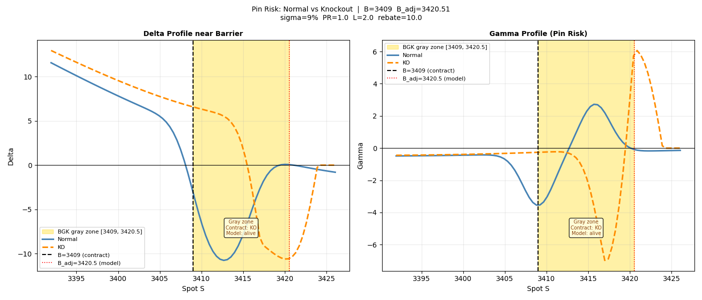

# Normal-vs-KO Comparison & Pin Risk 

How the knock-out feature reshapes the accumulator's risk profile, focusing on
the structuring trade-off, the barrier pin risk, and Greeks and Valuation sensitivity.

---

## Purpose

A knock-out accumulator is a normal accumulator plus a barrier that terminates
the contract on first touch (paying a rebate). This module compares the two
products from three angles a structurer and a risk manager would care about:

1. **Structuring trade-off** — how much better a strike can a client get by
   accepting knock-out risk?
2. **Pin risk** — what happens to Delta and Gamma when the spot is close to 
   barrier, and what is "gray zone"?
3. **Greeks and Valuation sensitivity** — how do value and Greeks behave as spot and vol
   move?

### Test scenario

| Parameter                       | Value                         |
|---------------------------------|-------------------------------|
| Spot S                          | 3362                          |
| Barrier B                       | 3409                          |
| Volatility                      | 9%                            |
| Participation PR                | 1.0                           |
| Leverage L                      | 2.0                           |
| Rebate (KO)                     | 10.0                          |

---

## 1. Zero-Cost Strike Trade-Off

A common way to sell these products is "zero-cost": the strike (and, for the
KO, the rebate) is set so the contract has zero value at initial time. The question for
the client is whether accepting knock-out risk buys a better strike.

The top panel shows the zero-cost strike of the knock-out product as the
rebate varies, against the normal product's fixed zero-cost strike (3307.87).
The bottom panel shows the effective strike improvement for the client.

When rebate is low, investors take a greater risk of loss from knocking out, 
thus can gain a better strike. As rebate increase, the strike become increasingly worse.

---

## 2. Pin Risk Near the Barrier: From Baseline Pin to Near-Close Fixing Risk

Pin risk has two regimes. Away from the observation close, remaining diffusion
time still smooths the barrier event, so the KO's risk appears as a localized Delta
cliff and Gamma spike. Near the observation close, that smoothing almost
disappears: the barrier event becomes a fixing outcome, and both the normal and
KO accumulators can show large local Gamma.

### Baseline pin risk away from fixing time

In the baseline pin-risk plot, spot is close to the barrier but the observation
close is not yet the dominant feature. The shaded band runs from the contractual
barrier B=3409 to the model-adjusted barrier B_adj=3420.51, a width of 11.5
points. This is the BGK gray zone: daily monitoring is less
likely to touch than continuous monitoring, so the continuous-barrier formula
uses an outward-shifted effective barrier.

In this regime, the main story is the KO's model-state transition. As spot
approaches B_adj, the KO Delta falls toward zero because the model is switching
from an alive position to the knocked-out rebate state. Gamma becomes locally
negative with peak around -1 because it is the slope of this Delta drop. 

The normal accumulator is much smoother in this baseline view. It has a payoff
cliff at B, but it does not terminate the remaining contract, so its local
Greeks are less explosive away from the fixing time.

### Near-close fixing risk: the main risk

The risk becomes more severe when spot is near the barrier and the observation
close is near. The remaining diffusion window is then very small, so the
barrier is no longer mainly a smooth path-probability problem. It becomes almost
a binary fixing question:

> Will the close finish below or above the barrier?

This is why near-close pin risk becomes **much more severe**.

- **KO Delta:** as spot approaches the barrier, a small upward move increases
  the ordinary accumulator payoff, but it also increases the probability of
  knock-out at the fixing. Near the barrier, the second effect can dominate:
  the product may lose remaining continuation value and receive only the
  rebate. This is why KO Delta can fall sharply, turn negative, and then return
  toward zero once the model treats the contract as knocked out.

- **KO Gamma:** when Delta collapses, Gamma turns strongly negative; when Delta
  recovers from negative back toward zero, Gamma turns strongly positive. The
  double spike is not a stable "good gamma / bad gamma" signal. Near the fixing, 
  the Greeks are highly unstable and should be treated as a risk warning rather 
  than reliable hedge ratios.

- **Normal Delta/Gamma:** the normal accumulator does not knock out, but it is
  not immune near the fixing. Its daily payoff still has a cliff at B: above
  the barrier, the daily payoff is zero. When there is little time left before
  the close, this payoff cliff is no longer smoothed by much future diffusion.
  The normal product can therefore also show a Delta drop and Gamma sign
  changes. The economic difference is that the normal product has current
  observation payoff-cliff risk; the KO has full survival/termination risk.

### Risk-management implication

Near the fixing, the contractual barrier B is the only operational trigger that matters. 
The knock-out decision is made by the actual barrier, not by the BGK-adjusted 
barrier B_adj. B_adj is only a modeling artifact of the Haug+BGK approximation; it may 
explain where the model's discontinuity appears, but it should not be treated as a trading 
or hedging trigger in the fixing window.

This is an operational pin risk. Once spot is close to B near 
the observation close, local finite-difference Delta and Gamma should not be used as hedge 
ratios, and their exact values should not be over-interpreted. The useful signal is that 
the Greeks have become unstable at all. The desk should switch to monitoring the actual 
fixing rule, scenario repricing around the contractual barrier B, and manual risk control.

(See [`analysis/bump_size.py`](../../analysis/bump_size.py) for why the
finite-difference Greeks themselves become unreliable near the barrier.)

---

## 3. Greeks and Valuation Sensitivity

After setting the contract to zero-cost (solving for both strike K=3307.87 and
rebate=17.56), this panel sweeps spot and volatility to compare how the two
products behaving.

### Value vs Spot (top-left)

When prices are low enough, the values of the two products are almost identical. 
However, as prices approach or exceed the barrier price, the value of the **KO** stabilizes 
at the knock-out payout, while the value of the **Normal** decreases after reaching its peak. 
This is because at this point, exceeding the **B** results in zero payout daily, but the 
contract still alive, thus higher prices cause the option value to decline.

### Value vs Volatility (top-right)

Both products lose value as vol rises — both are **short vega**, This is because, 
as volatility increases, if prices fall, the leverage downside can blow the losses. 
If prices rise, the option will either terminate or not pay out daily. 
The reason that the value of **KO** decreases more slowly than **Normal** is knocking out 
can generate rebate, which to some extent compensates for the value loss.

### Delta vs Volatility (bottom-left)

The KO's delta rises noticeably with vol, while the normal's is flatter. Higher
vol raises the probability of reaching the barrier, increasing the KO's
sensitivity to spot, this reflects the cross-influence of price and volatility.
(the same effect that makes the KO's Vanna larger in the PnL analysis).

### Gamma vs Volatility (bottom-right)

Both gammas are negative (short convexity). At low vol the KO's gamma is more
negative than the normal's — low vol concentrates the knock-out probability
near the barrier, sharpening the gamma. Meanwhile, high vol smooths the discontinuity,
the options are less sensitive to whether they are knocked out.
This is a useful warning: **the knock-out's gamma instability is worst in
low-volatility regimes**, precisely when desks might otherwise expect calm
hedging.

